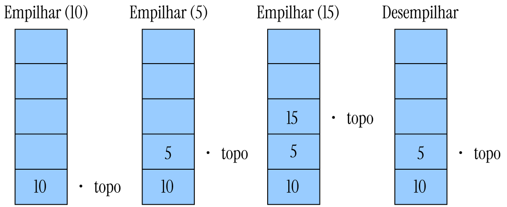

# 1. Pilhas

Pilhas são estruturas de dados do tipo LIFO (Last-In, First-Out), nas quais o último elemento inserido é o primeiro a ser removido. Assim, em uma pilha, o acesso é permitido apenas ao último item adicionado. Para acessar o penúltimo elemento, é necessário remover o item mais recente.

    
    
Figura 1: Pilha.

Exemplos de uso de pilhas em sistemas incluem:

- Chamadas recursivas em compiladores;
- Mecanismos de desfazer/refazer em editores de texto;
- Navegação entre páginas da Web.

Pilhas podem ser implementadas usando vetores, em que a alocação de memória para os elementos é contígua, ou listas encadeadas. Nessa estrutura, a manipulação de elementos ocorre apenas em uma extremidade, denominada "topo", enquanto a outra extremidade é chamada de "base".

## 1.1. Operações com Pilha

As operações típicas de uma pilha incluem:

- **Criação da pilha:** Define a capacidade, no caso de implementação sequencial por vetor;
- **Empilhar (push):** Adiciona um elemento no topo;
- **Desempilhar (pop):** Remove o elemento do topo;
- **Mostrar o topo (top):** Acessa o elemento no topo sem removê-lo;
- **Verificar se está vazia (isEmpty):** Confirma se a pilha não contém elementos;
- **Esvaziar (empty):** Remove todos os elementos da pilha.

Supondo uma pilha com capacidade para 5 elementos (5 nós).

    
    
Figura 2: Pilha com capacidade para 5 elementos.

Essas operações podem ser visualizadas de maneira semelhante ao uso de uma pilha de pratos em um restaurante ou a manipulação de cartas em um jogo de baralho.
