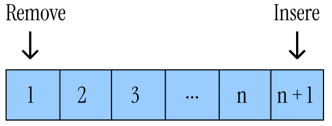
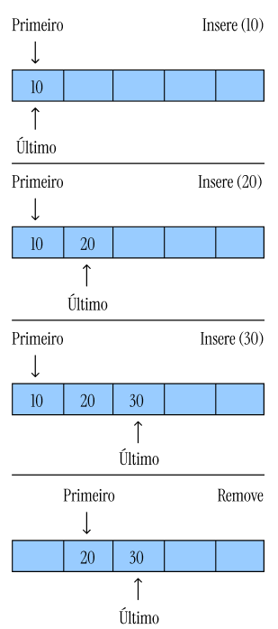

# 2. Filas

Filas são estruturas de dados do tipo FIFO (First-In, First-Out), onde o primeiro elemento inserido é o primeiro a ser removido. Assim, itens são adicionados no final da fila e removidos do início.

    
    
Figura 2.1: Fila.

Exemplos de uso de filas em sistemas incluem:

- Controle de documentos para impressão;
- Troca de mensagens entre computadores em uma rede.

A implementação de filas pode ser realizada por meio de vetores, com alocação contígua de memória para os elementos, ou por listas encadeadas.

## 2.1. Operações com Fila

As operações comuns em uma fila incluem:

- **Criação da fila:** Definição da capacidade, no caso de implementação sequencial por vetor;
- **Enfileirar (enqueue):** Adiciona um elemento ao final da fila;
- **Desenfileirar (dequeue):** Remove o elemento do início da fila;
- **Mostrar o primeiro elemento (first):** Acessa o primeiro item sem removê-lo;
- **Tamanho da fila (size):** Informa o número de elementos na fila;
- **Verificar se está vazia (isEmpty):** Verifica se não há elementos na fila.

Supondo uma fila com capacidade para 5 elementos (5 nós).

    
    
Figura 2.2: Fila com capacidade para 5 elementos.

Essas operações podem ser comparadas a uma fila de pessoas em um banco. No entanto, ao contrário de uma fila física, onde os elementos se movem, nas filas de dados, o computador apenas atualiza o indicador de posição para o primeiro elemento, evitando custos de processamento.
