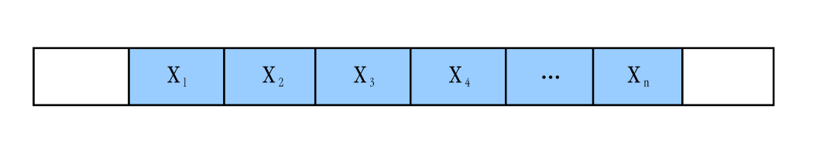
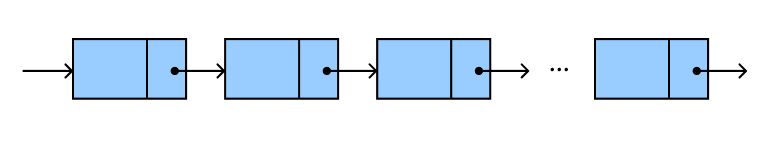

# 7. Listas Lineares 

Uma lista linear é uma estrutura de dados onde os elementos de um mesmo tipo estão organizados de maneira sequencial, refletindo uma ordem lógica, embora não necessariamente armazenados de forma contígua na memória. Um exemplo seria a fila de espera de um consultório médico, onde, apesar das pessoas estarem em diferentes locais, existe uma ordem definida de atendimento. Portanto, listas lineares permitem organizar dados relacionados, preservando a ordem entre os elementos. Cada elemento de uma lista é chamado de nó, ou nodo.

## 7.1 Definição

Uma lista linear é composta por um conjunto de N nós, onde N ≥ 0, organizados de forma a refletir a posição relativa de cada elemento. O primeiro nó é denotado por $𝑥_1$ e, para qualquer nó $𝑥_𝑘$, com 1 < 𝑘 < 𝑛, ele é precedido pelo nó $𝑥_{𝑘−1}$ e seguido pelo nó $𝑥_{𝑘+1}$, sendo $𝑥_𝑛$ o último. Quando N = 0, a lista está vazia.

Exemplos de listas lineares:

- Pessoas em uma fila de banco;
- Letras em uma palavra;
- Notas de alunos em uma turma;
- Itens de estoque de uma empresa;
- Dias da semana;
- Vagões de um trem;
- Pilha de pratos;
- Cartas de baralho.

## 7.2. Alocação de uma Lista

A alocação de memória para uma lista pode ser realizada de duas formas:

- **Sequencial ou Contígua:** Os nós estão organizados logicamente e fisicamente em sequência, como em um vetor.

    
    
Figura 7.1: Lista linear sequencial.

- **Encadeada:** Os nós estão ligados por referências, mas não necessariamente armazenados de forma contígua na memória, preservando a ordem lógica entre eles.

## 7.3. Operações com Listas

As operações comuns em listas lineares incluem:

- Criação de uma lista;
- Inserção de um elemento;
- Remoção de um elemento;
- Acesso a um elemento;
- Alteração de um elemento;
- Cópia da lista;
- Localização de um nó.

## 7.4. Tipos de Listas Lineares

Os tipos mais comuns de listas lineares são:

- **Pilhas:** Estruturas LIFO (Last In, First Out), onde o último elemento inserido é o primeiro a sair. As operações ocorrem em um único ponto de acesso, chamado de topo. Exemplo: pilha de pratos, pilha de livros.

- **Filas:** Estruturas FIFO (First In, First Out), onde o primeiro elemento a entrar é o primeiro a sair. A inserção ocorre em uma extremidade e a remoção em outra. Exemplo: fila de banco, fila de espera.

- **Deques:** Estruturas que permitem inserção e remoção de elementos em ambas as extremidades, sendo uma generalização das filas.

A distinção entre esses tipos de listas é definida pelas operações permitidas, e todas podem ser implementadas com alocação sequencial ou encadeada.

## 7.5 Listas Lineares Encadeadas

Em listas lineares encadeadas, ao contrário das listas lineares sequenciais (ou contíguas), os elementos não estão necessariamente armazenados em locais consecutivos na memória. Para manter a ordem lógica dos elementos, as listas encadeadas podem ser implementadas de duas formas:

- **Simplesmente encadeada (lista ligada):** Cada elemento contém, além do espaço para armazenar sua informação, uma referência à localização do próximo elemento da lista.

    
    
Figura 7.2: Lista simplismente encadeada.

- **Duplamente encadeada (lista duplamente ligada):** Cada elemento armazena, além da informação, uma referência tanto para o próximo quanto para o elemento anterior da lista.

A principal vantagem da lista duplamente encadeada sobre a simplesmente encadeada é a facilidade de navegação em ambos os sentidos (do início para o fim e vice-versa), o que facilita operações como inclusão e remoção de nós, reduzindo a quantidade de variáveis auxiliares necessárias.

Em comparação com as listas sequenciais, as listas encadeadas apresentam uma vantagem significativa em termos de desempenho para inserção e remoção de elementos. Em listas contíguas, é necessário deslocar todos os elementos para realizar essas operações. Já nas listas encadeadas, como os elementos não precisam estar em posições contíguas na memória, basta ajustar as referências entre os nós, tornando a inserção ou remoção mais rápida e eficiente. Essa estrutura é ideal para listas com grande quantidade de nós, onde operações em listas contíguas podem resultar em perdas notáveis de desempenho.