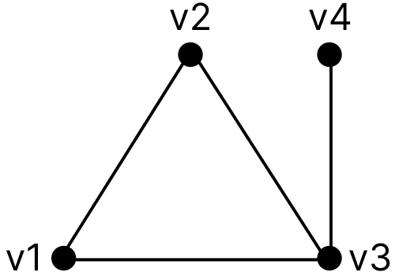

# 19. Grafo (Conceitos Básicos)

Um grafo é uma estrutura matemática composta por um conjunto de vértices (ou nós) e um conjunto de arestas que conectam pares de vértices. Formalmente, um grafo pode ser representado como G = (V, A), onde:

- V é o conjunto de vértices;
- A é o conjunto de arestas.

Arestas podem ou não possuir direção, o que define diferentes tipos de grafos.

- **Dígrafo (grafo direcionado):** é um grafo no qual as arestas possuem uma direção, ou seja, cada aresta parte de um vértice e aponta para outro, indicando um sentido único de conexão.

- **Ordem do grafo:** é a quantidade de vértices, ou seja, o tamanho do conjunto V. Nos dois exemplos abaixo, a ordem é 4.

| Grafo simples | Dígrafo |
| ------------- | ------- |
|  |  |