# 19. Grafo (Conceitos Básicos)

Um grafo é uma estrutura matemática composta por um conjunto de vértices (ou nós) e um conjunto de arestas que conectam pares de vértices. Formalmente, um grafo pode ser representado como G = (V, A), onde:

- V é o conjunto de vértices;
- A é o conjunto de arestas.

Arestas podem ou não possuir direção, o que define diferentes tipos de grafos.

- **Dígrafo (grafo direcionado):** é um grafo no qual as arestas possuem uma direção, ou seja, cada aresta parte de um vértice e aponta para outro, indicando um sentido único de conexão.

- **Ordem do grafo:** é a quantidade de vértices, ou seja, o tamanho do conjunto V. Nos dois exemplos abaixo, a ordem é 4.

| Grafo simples | Dígrafo |
| ------------- | ------- |
|  | 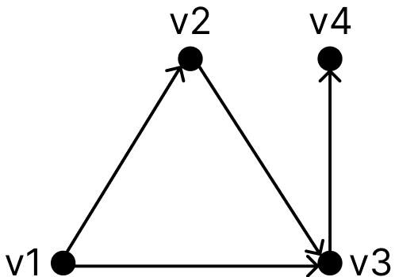 |

- **Adjacência:** dois vértices são adjacentes quando existe uma aresta que os conecta. O mesmo vale para duas arestas que incidem sobre um mesmo vértice.

- **Grau de um vértice:** é a quantidade de arestas que incidem sobre o vértice. Em um dígrafo:
  - O grau de saída de um vértice \(v\) é o número de arestas que possuem \(v\) como ponta inicial.
  - O grau de entrada de um vértice \(v\) é o número de arestas que possuem \(v\) como ponta final.

| Grafo         | Observações |
| ------------- | ----------- |
|  | - \(v1\) e \(v2\) são vértices adjacentes;  - \(a1\) e \(a4\) são arestas adjacentes;  - O vértice \(v1\) possui grau igual a 3. |

- **Laço:** é uma aresta que conecta um vértice a ele mesmo.
- **Arestas paralelas:** são duas ou mais arestas que conectam o mesmo par de vértices.
- **Multigrafo:** é um grafo que permite laços e/ou arestas paralelas. Caso contrário, é denominado grafo simples.

| Grafo         | Observações |
| ------------- | ----------- |
| 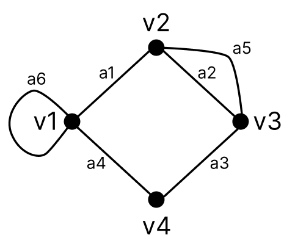 | - \(a6\) é um laço;  - \(a2\) e \(a5\) são arestas paralelas;  - Trata-se de um multigrafo. |

- **Grafo completo:** é um grafo em que todos os vértices são adjacentes entre si, ou seja, há uma aresta entre cada par distinto de vértices. Em um grafo completo de ordem $n$, o número total de arestas é dado pela fórmula:

$$
|A| = \frac{n(n - 1)}{2}
$$

| Grafo | Observações |
| ----- | ----------- |
| 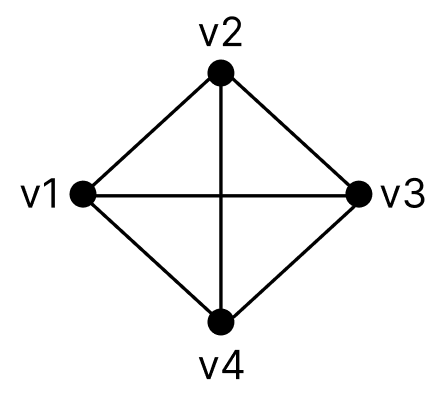 | - $K_n$: grafo completo de ordem $n$. - O grafo ao lado representa $K_4$. - Como $n = 4$, então o número de arestas é $\frac{4(4 - 1)}{2} = 6$. |

- **Grafo bipartido:** é um grafo cujos vértices podem ser divididos em dois conjuntos disjuntos, de modo que todas as arestas conectam vértices de conjuntos diferentes.

| Grafo | Observações |
| ----- | ----------- |
| 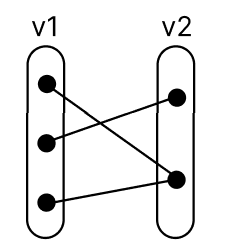 | - Conjunto \(v1\) possui 3 vértices;  - Conjunto \(v2\) possui 2 vértices;  - Cada aresta conecta um vértice de \(v1\) a um vértice de \(v2\). |

- **Grafo rotulado:** é um grafo em que os vértices possuem rótulos ou identificações únicas.

- **Grafo valorado (ou ponderado):** é um grafo em que as arestas possuem valores (ou pesos), que podem representar custo, distância, tempo, entre outros.

| Grafo rotulado | Grafo valorado |
| -------------- | -------------- |
| 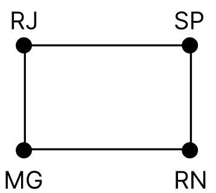 | 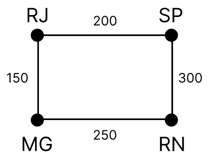 |

- **Subgrafo:** é um grafo formado por um subconjunto de vértices e arestas de outro grafo.

| Grafo | Subgrafo |
| ----- | -------- |
| 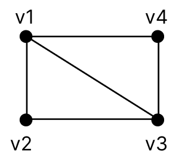 | 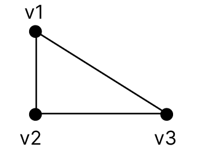 |

- **Grafos isomorfos:** são grafos que possuem a mesma estrutura de conexões, embora possam ter diferentes rótulos nos vértices.

- **Grafo regular:** é um grafo em que todos os vértices possuem o mesmo grau.

| Grafo | Grafo | Observações |
| ----- | ----- | ----------- |
| 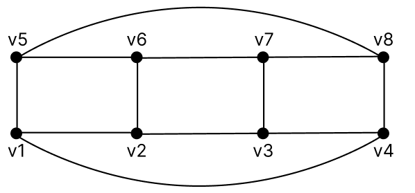 | 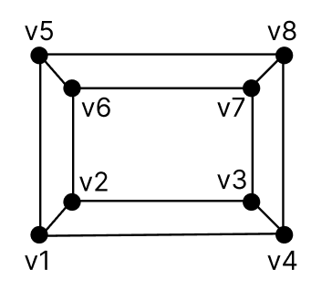 | - São regulares de grau 3; - Possuem a mesma estrutura de conexões, ou seja, os mesmos pares de vértices estão conectados. |

- **Clique em um grafo:** é um subconjunto de vértices no qual todos os pares estão conectados entre si.

- **Conjunto independente de vértices:** é um conjunto de vértices no qual nenhum par é adjacente, ou seja, não há arestas entre eles.

| Grafo | Observações |
| ----- | ----------- |
| 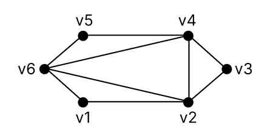 | - Clique $K_4$: {v2, v3, v4, v6};   - Conjunto independente: {v1, v3, v5}. |

- **Grafo complementar:** é um grafo construído a partir de um grafo original, mantendo os mesmos vértices, mas incluindo apenas as arestas que não existem no grafo original. Em outras palavras, dois vértices estarão conectados no grafo complementar somente se não estiverem conectados no grafo original.

| Grafo | Grafo complementar |
| ----- | ------------------ |
| 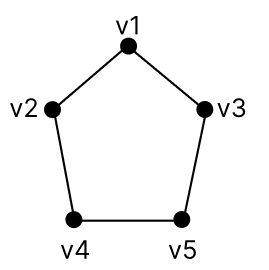 | 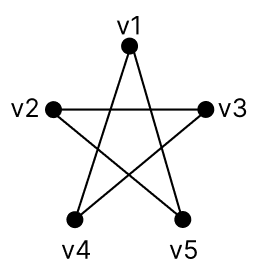 |

- **Grafo parcial:** é um subgrafo que mantém todos os vértices do grafo original, mas apenas algumas de suas arestas.

| Grafo | Grafo parcial |
| ----- | ------------- |
|  | 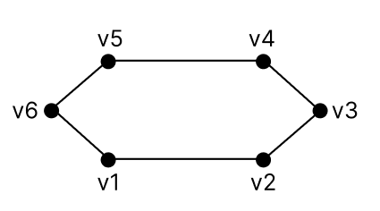 |

- **Hipergrafo:** é uma generalização do conceito de grafo em que uma aresta (chamada de hiperaresta) pode conectar mais de dois vértices.

| Hipergrafo | Observações |
| ---------- | ----------- |
| 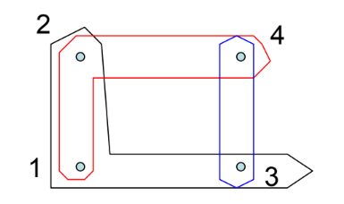 | - Vértices: {1, 2, 3, 4};   - Hiperarestas: {{1, 2, 4}, {1, 2, 3}, {3, 4}}. |