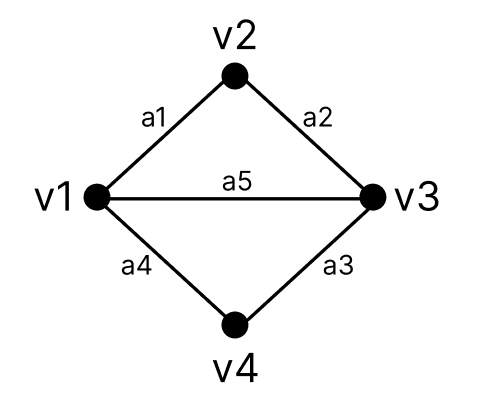

# 19. Grafo (Conceitos Básicos)

Um grafo é uma estrutura matemática composta por um conjunto de vértices (ou nós) e um conjunto de arestas que conectam pares de vértices. Formalmente, um grafo pode ser representado como G = (V, A), onde:

- V é o conjunto de vértices;
- A é o conjunto de arestas.

Arestas podem ou não possuir direção, o que define diferentes tipos de grafos.

- **Dígrafo (grafo direcionado):** é um grafo no qual as arestas possuem uma direção, ou seja, cada aresta parte de um vértice e aponta para outro, indicando um sentido único de conexão.

- **Ordem do grafo:** é a quantidade de vértices, ou seja, o tamanho do conjunto V. Nos dois exemplos abaixo, a ordem é 4.

| Grafo simples | Dígrafo |
| ------------- | ------- |
|  |  |

- **Adjacência:** dois vértices são adjacentes quando existe uma aresta que os conecta. O mesmo vale para duas arestas que incidem sobre um mesmo vértice.

- **Grau de um vértice:** é a quantidade de arestas que incidem sobre o vértice. Em um dígrafo:
  - O grau de saída de um vértice \(v\) é o número de arestas que possuem \(v\) como ponta inicial.
  - O grau de entrada de um vértice \(v\) é o número de arestas que possuem \(v\) como ponta final.

| Grafo         | Observações |
| ------------- | ----------- |
|  | - \(v1\) e \(v2\) são vértices adjacentes;  - \(a1\) e \(a4\) são arestas adjacentes;  - O vértice \(v1\) possui grau igual a 3. |

- **Laço:** é uma aresta que conecta um vértice a ele mesmo.
- **Arestas paralelas:** são duas ou mais arestas que conectam o mesmo par de vértices.
- **Multigrafo:** é um grafo que permite laços e/ou arestas paralelas. Caso contrário, é denominado grafo simples.

| Grafo         | Observações |
| ------------- | ----------- |
|  | - \(a6\) é um laço;  - \(a2\) e \(a5\) são arestas paralelas;  - Trata-se de um multigrafo. |

- **Grafo completo:** é um grafo em que todos os vértices são adjacentes entre si, ou seja, há uma aresta entre cada par distinto de vértices. Em um grafo completo de ordem $n$, o número total de arestas é dado pela fórmula:

$$
|A| = \frac{n(n - 1)}{2}
$$

| Grafo | Observações |
| ----- | ----------- |
|  | - $K_n$: grafo completo de ordem $n$. - O grafo ao lado representa $K_4$. - Como $n = 4$, então o número de arestas é $\frac{4(4 - 1)}{2} = 6$. |