# 20. Representação de Grafos

Grafos podem ser representados de diversas formas em estruturas computacionais e matemáticas, sendo as mais comuns a matriz de adjacência, matriz de custo, lista de arestas, lista de adjacência e a matriz de incidência. 

## 20.1. Matriz de Adjacência

Representa um grafo usando uma matriz $A$ de dimensão $n \times n$, onde $n$ é o número de vértices. Cada entrada $A_ij$ indica a existência de uma aresta entre os vértices $i$ e $j$.

- Em grafos não direcionados, a matriz é simétrica, pois se há uma aresta entre $V_i$ e $V_j$, então também há entre $V_j$ e $V_i$.
- Em grafos direcionados, o valor de $A_ij$ representa o número de arestas que partem do vértice $V_i$ e chegam ao vértice $V_j$.

---

**Grafo não direcionado**

| Grafo | Matriz de adjacência |
| ----- | -------------------- |
| 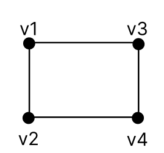 | 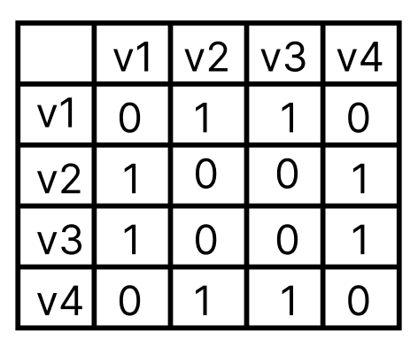 |

---

**Grafo direcionado**

| Grafo | Matriz de adjacência |
| ----- | -------------------- |
| 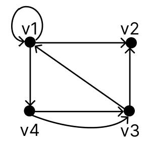 | 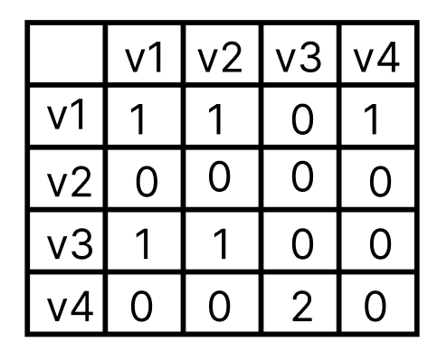 |

## 20.2. Matriz de Custo

A matriz de custo é uma variação da matriz de adjacência, na qual cada entrada $C_{ij}$ armazena o peso (ou custo) da aresta entre os vértices $i$ e $j$. Se não houver aresta entre dois vértices, pode-se representar essa ausência usando um valor especial, como:

- `0` (sem custo),
- `-1` (inexistente),
- ou $\infty$ (infinito), dependendo do contexto da aplicação (ex: algoritmos de caminhos mínimos).

| Grafo | Matriz de custo |
| ----- | --------------- |
| 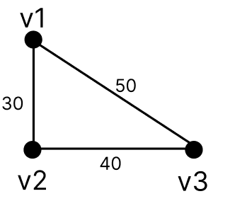 | 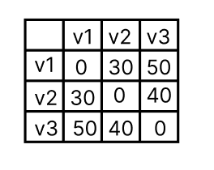 |

## 20.3. Lista de Arestas

Representa um grafo utilizando duas listas de vértices:  
- uma lista $g$ com os vértices de origem das arestas,  
- e uma lista $h$ com os vértices de destino correspondentes.

Cada par $(g_i, h_i)$ representa uma aresta do grafo.

| Grafo | Lista de arestas |
| ----- | ---------------- |
| 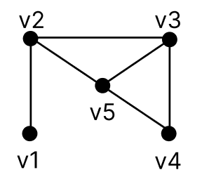 | $g$ = {v1, v2, v2, v3, v3, v4}  $h$ = {v2, v3, v5, v4, v5, v5} |

## 20.4. Lista de Adjacência

Um vértice $y$ em um grafo é chamado de sucessor de outro vértice $x$ se existe uma aresta direcionada de $x$ para $y$. Assim, um grafo pode ser descrito pela lista de todos os sucessores de cada vértice.

| Grafo | Lista de adjacência |
| ----- | ------------------- |
| 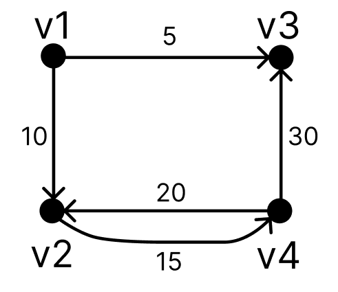 | v1: v2 → v3   v2: v4   v3: sem sucessor   v4: v2 → v3 |

## 20.5. Matriz de Incidência

A matriz de incidência representa a relação entre vértices e arestas utilizando uma matriz $M$ de dimensão $n \times m$, onde:

- $n$ é o número de vértices,
- $m$ é o número de arestas,
- e cada entrada $M_{ij}$ indica se o vértice $i$ está conectado à aresta $j$.

Nos grafos não direcionados, os valores geralmente são `1` se o vértice está conectado à aresta, e `0` caso contrário.

Nos grafos direcionados, utiliza-se:
- `-1` para indicar que o vértice é o origem da aresta (saída),
- `1` para indicar que o vértice é o destino da aresta (entrada),
- `0` para ausência de relação com a aresta.

---

**Grafo não direcionado**

| Grafo | Matriz de incidência |
| ----- | -------------------- |
| 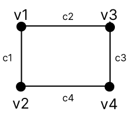 | 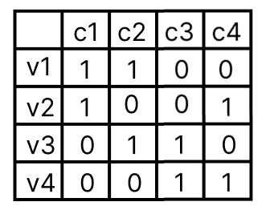 |

---

**Grafo direcionado**

| Grafo | Matriz de incidência |
| ----- | -------------------- |
| 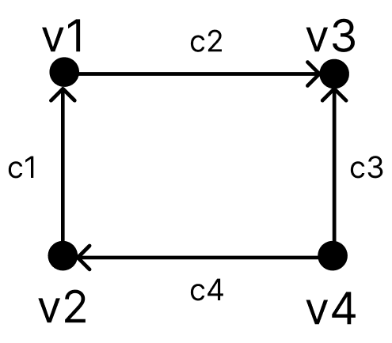 | 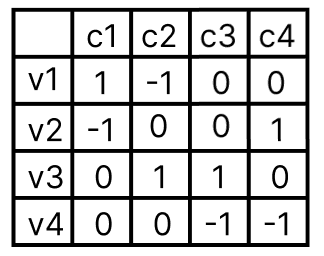 |